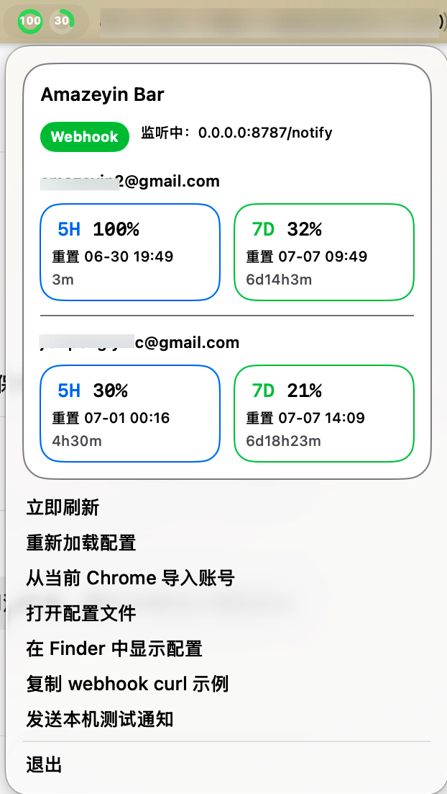

# AmazeyinBar

把账号用量、桌面提醒和自动化通知，收进 macOS 菜单栏。

`AmazeyinBar` 是一个轻量、直接、日常可用的菜单栏小工具：
- 一眼看到多个账号的 `5H / 7D` 用量
- 支持 webhook 推送，把 Jenkins、脚本、内网任务的结果直接送到桌面
- 支持从当前 Chrome 页面或剪贴板 cURL 导入账号配置，尽量减少手工填 token 的麻烦

它的目标不是“功能很多”，而是“每天都能顺手打开，而且真的省事”。

## 示例截图



## 功能亮点

- 菜单栏直接查看多账号用量，不用反复切后台
- 显示 `5H / 7D` 利用率、重置时间和剩余倒计时
- 本地 webhook 接收器，适合 Jenkins / Shell / 自动化任务完成提醒
- 支持系统原生通知
- 支持手动刷新、重新加载配置、快速打开配置目录
- 支持从当前 Chrome 页面导入 OpenAI / ChatGPT 相关账号配置
- 支持从剪贴板粘贴 cURL 导入 ChatGPT 凭据

## 适合谁

- 想在菜单栏里快速盯用量的人
- 有多账号切换场景的人
- 想把“构建完成 / 脚本执行完 / 服务状态变化”直接弹到桌面的人
- 不想维护复杂后台，只想要一个本地可跑的小工具的人

## 本地运行

```bash
cd /Users/yin/tools/codex-workspace/amazeyin/gpt-usage-menubar
swift run GPTUsageBar
```

首次启动后会生成配置文件：

`~/Library/Application Support/GPTUsageBar/config.json`

## 打包成 App

```bash
cd /Users/yin/tools/codex-workspace/amazeyin/gpt-usage-menubar
chmod +x scripts/build-app.sh
./scripts/build-app.sh
open dist/AmazeyinBar.app
```

## 自动构建 Release

仓库已包含 GitHub Actions 自动发布流程：

- 推送 tag，例如 `v1.0.0`
- GitHub Actions 会自动在 macOS runner 上构建 `.app`
- 自动打包成 `AmazeyinBar-macos.zip`
- 自动创建 / 更新 GitHub Release 并上传产物

推荐发布方式：

```bash
git tag v1.0.0
git push origin v1.0.0
```

你也可以在 GitHub Actions 页面手动触发发布流程。

## Webhook 通知

默认 webhook 地址格式：

`http://你的Mac局域网IP:8787/notify?token=你的token`

示例：

```bash
curl -X POST "http://你的Mac局域网IP:8787/notify?token=你的token" \
  -H "Content-Type: application/json" \
  -d '{
    "title": "Jenkins",
    "subtitle": "构建完成",
    "message": "deploy-prod 执行成功"
  }'
```

也支持纯文本：

```bash
curl -X POST "http://你的Mac局域网IP:8787/notify?token=你的token" \
  -H "Content-Type: text/plain; charset=utf-8" \
  -d '任务完成'
```

支持字段：

- `title`
- `subtitle`
- `message` 或 `body`
- `sound`

支持认证方式：

- Query：`?token=xxx`
- Header：`token: xxx`
- Header：`Authorization: Bearer xxx`

## 账号导入方式

菜单中现在提供两种更通用的导入方式：

- `从当前 Chrome 页面导入账号`
- `从剪贴板 cURL 导入 ChatGPT 账号`

### 方式一：从当前 Chrome 页面导入账号

前提：

- Chrome 允许远程调试连接
- 你已经在 Chrome 登录目标页面

支持两种页面来源：

- 你自己的账号管理后台，例如 `https://sub.amazeyin.com/admin/accounts`
- 官方 ChatGPT 页面，例如 `https://chatgpt.com` 或 `https://chat.openai.com`

导入逻辑：

- 如果当前打开的是账号管理后台，优先按原逻辑批量导入
- 如果没有后台页，会自动回退到当前打开的 ChatGPT 页面
- 在 ChatGPT 页面下，先发一条消息或触发一次真实请求，再点击导入，成功率最高

### 方式二：从剪贴板 cURL 导入 ChatGPT 账号

适合场景：

- 没有统一账号后台
- 只想导入单个 ChatGPT Web 账号
- 想从浏览器 DevTools 里直接复制一条请求完成导入

推荐抓取位置：

- `chatgpt.com` 的 `backend-api/...` 请求
- 尤其是这类请求：
  - `backend-api/f/conversation/prepare`
  - 其他带 `authorization` 和 `chatgpt-account-id` 请求头的 `conversation` / `backend-api` 请求

最关键的请求头：

- `authorization: Bearer ...`
- `chatgpt-account-id: ...`

抓取步骤：

- 打开 Chrome DevTools 的 `Network`
- 勾选 `Preserve log`
- 在 `chatgpt.com` 新开对话或发送一条消息
- 找到 `backend-api` / `conversation` 请求
- 右键该请求，选择 `Copy as cURL`
- 回到 `AmazeyinBar`，点击 `从剪贴板 cURL 导入 ChatGPT 账号`

### 命令行脚本：从当前 Chrome 自动导入

如果你更习惯命令行，也保留了脚本方式：

- 你已经在 Chrome 登录目标后台
- 当前打开着账号管理页
- Chrome 允许远程调试连接

执行：

```bash
cd /Users/yin/tools/codex-workspace/amazeyin/gpt-usage-menubar
node ./scripts/import-from-chrome.mjs
```

只看导入结果、不落盘：

```bash
node ./scripts/import-from-chrome.mjs --dry-run
```

## 配置示例

```json
{
  "refreshIntervalSeconds": 300,
  "titleMode": "fiveHour",
  "webhook": {
    "enabled": true,
    "bindAddress": "0.0.0.0",
    "path": "/notify",
    "port": 8787,
    "token": "REPLACE_WITH_WEBHOOK_TOKEN"
  },
  "accounts": [
    {
      "id": 3,
      "name": "主账号",
      "baseURL": "https://sub.amazeyin.com",
      "accessToken": "替换成 OpenAI access token",
      "chatgptAccountId": "替换成 chatgpt account id",
      "fedRAMP": false,
      "enabled": true
    }
  ]
}
```

## 项目结构

- `Sources/GPTUsageBarApp/`: Swift 源码
- `scripts/build-app.sh`: 打包 `.app`
- `scripts/import-from-chrome.mjs`: 从 Chrome 后台页导入配置
- `docs/`: 文档和示例截图

## 一句话总结

`AmazeyinBar` 不是一个“看起来很厉害”的工具，它更像一个每天都能替你省几次点击的小助手。
