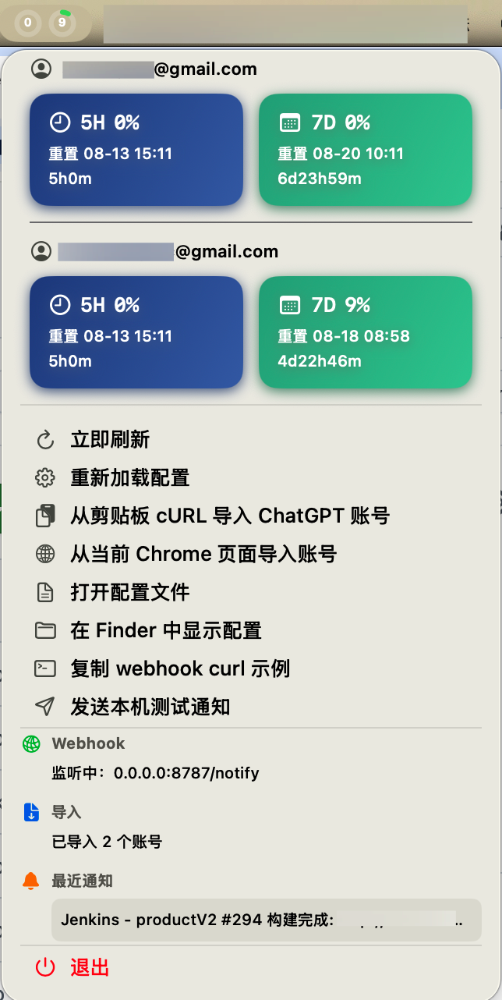

# AmazeyinBar

一个常驻 macOS 菜单栏的 GPT 用量与通用 Webhook 通知工具。它将多个 ChatGPT 账号的 5 小时、7 天用量集中展示，并将任意服务发送的 Webhook 消息通过 App 原生通知提醒你。



## 功能

- 状态栏以圆环显示账号 5H、7D 用量；可配置显示模式与最多两组账号。
- 下拉菜单以蓝色 5H 卡片、绿色 7D 卡片展示用量、重置时间与倒计时。
- 支持定时刷新和“立即刷新”。
- 支持从剪贴板粘贴 ChatGPT 请求 cURL 导入账号。
- 支持从当前 Chrome 页面导入账号或账号后台数据。
- 支持通过 Sub2API Admin API Key 导入后台账号，无需保持 Chrome 登录。
- 内置本地 Webhook 接收端，可接收任意服务的事件通知；Jenkins 构建通知只是其中一种调用示例。
- 使用 macOS 原生通知通道与系统默认提示音；通知展示策略由用户在系统设置中控制。
- 支持一键打开配置、显示配置目录、复制 Webhook cURL 示例与发送本机测试通知。

## 安装

从 [Releases](https://github.com/amazeyin2/AmazeyinBar/releases) 下载最新的 `AmazeyinBar-macos.zip`，解压后将 `AmazeyinBar.app` 拖入“应用程序”目录并启动。

首次启动会生成配置文件：

`~/Library/Application Support/GPTUsageBar/config.json`

若需要桌面通知，请在“系统设置 -> 通知 -> AmazeyinBar”中启用所需的横幅、通知中心、锁定屏幕和声音选项。

## 配置

以下是一个脱敏示例。请勿将真实 token、Cookie、Admin API Key 或 Webhook 密钥提交到仓库。

```json
{
  "refreshIntervalSeconds": 300,
  "titleMode": "compact",
  "accounts": [
    {
      "id": 1,
      "name": "主账号",
      "baseURL": "https://sub.example.com",
      "timezone": "Asia/Shanghai",
      "source": "active",
      "enabled": true
    }
  ],
  "importOptions": {
    "chromeAccountsURL": "https://sub.example.com/admin/accounts",
    "includePlatforms": ["openai"],
    "includeDisabledAccounts": false
  },
  "webhook": {
    "enabled": true,
    "bindAddress": "0.0.0.0",
    "port": 8787,
    "path": "/notify",
    "token": "REPLACE_WITH_WEBHOOK_TOKEN",
    "allowLockRequests": false
  }
}
```

### 状态栏模式

- `fiveHour`：显示每个账号的蓝色 5H 用量圆环。
- `sevenDay`：显示每个账号的绿色 7D 用量圆环。
- `compact`：同时显示 5H 与 7D 圆环，最多显示两个账号共四个圆环。

## 导入账号

### 通过 Sub2API Admin API Key 导入（推荐）

适用于使用 [sub2api](https://github.com/Wei-Shaw/sub2api) 的账号后台。管理员在后台生成 Admin API Key 后，选择菜单中的“通过 Sub2API API Key 导入账号”，填写后台地址并粘贴 `admin-...` 密钥即可。App 只会导入平台筛选匹配、状态正常且“调度”开关已启用的 OpenAI 账号；再次导入会同步移除该后台中已关闭调度的已导入账号。额度通过 `x-api-key` 查询，不需要连接或保持 Chrome 登录。

密钥仅保存于 macOS Keychain，`config.json` 不会保存它。该密钥拥有后台管理员权限，请仅在自己的受信任 Mac 上使用；重新生成或删除密钥后，需要再次导入。

### 从剪贴板 cURL 导入

在已登录的 `chatgpt.com` 页面打开浏览器开发者工具，选择一条需要授权的 ChatGPT 请求并使用“Copy as cURL”。复制后，在 AmazeyinBar 菜单中选择“从剪贴板 cURL 导入 ChatGPT 账号”。

仅使用你自己的登录会话。cURL 中的授权信息等同于登录凭据，不应发送给他人或提交到 Git。

### 从当前 Chrome 页面导入

打开已登录的 `chatgpt.com` 页面或已配置的账号后台页面，再从菜单选择“从当前 Chrome 页面导入账号”。该功能需要 Chrome 开启远程调试并能被本机应用访问。对于 Sub2API 后台账号，优先使用上方的 Admin API Key 导入方式，避免短期浏览器会话 Token 失效。

## Webhook 通知

默认接收地址为：

```text
http://<Mac 局域网 IP>:8787/notify
```

启用 `token` 后，可使用查询参数或请求头传递：

```bash
curl -X POST "http://<Mac 局域网 IP>:8787/notify?token=REPLACE_WITH_WEBHOOK_TOKEN" \
  -H "Content-Type: application/json" \
  -d '{"title":"部署服务","subtitle":"任务完成","message":"生产环境已成功发布","sound":true}'
```

Jenkins 可按同一接口推送构建结果，也可以接入 CI/CD、监控告警、定时任务或任何能够发送 HTTP 请求的服务。

### 锁屏与唤醒显示器

Webhook 启用后，以下端点与 `/notify` 共用相同的 `token` 校验。`/lock` 默认关闭；在配置文件的 `webhook` 中将 `allowLockRequests` 设为 `true` 后才会接受锁屏请求：

```json
"allowLockRequests": true
```

```bash
# 立即让显示器休眠；是否要求密码由 macOS“锁定屏幕”设置决定。
curl -X POST "http://<Mac 局域网 IP>:8787/lock?token=REPLACE_WITH_WEBHOOK_TOKEN"

# 唤醒显示器；若当前会话已经锁定，仍必须由用户使用密码、Touch ID 等方式解锁。
curl -X POST "http://<Mac 局域网 IP>:8787/unlock?token=REPLACE_WITH_WEBHOOK_TOKEN"
```

`/unlock` 不会、也不能绕过 macOS 的登录认证。请务必设置高强度 `token`，并避免将 `8787` 端口暴露到公网。

请求体字段：

- `title`：通知标题，必填。
- `subtitle`：通知副标题，可选。
- `message`：通知正文，必填。
- `sound`：是否播放系统默认提示音，默认 `true`。
- `url`：预留跳转地址，可选。

## 本地开发

要求：macOS 14+、Xcode Command Line Tools、Swift 6。

```bash
git clone https://github.com/amazeyin2/AmazeyinBar.git
cd AmazeyinBar
swift run GPTUsageBar
```

构建 App：

```bash
chmod +x scripts/build-app.sh
./scripts/build-app.sh
open dist/AmazeyinBar.app
```

## 发布

推送 `v*` 标签会自动触发 GitHub Actions，在 macOS 构建并创建包含 `AmazeyinBar-macos.zip` 的 Release。

```bash
git tag -a v1.0.5 -m "AmazeyinBar v1.0.5"
git push origin v1.0.5
```
